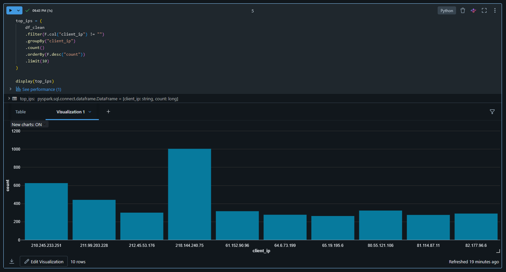

# Security Log Data Pipeline (Databricks, PySpark)

## Overview
This project implements an end-to-end data pipeline for processing and analyzing Apache security logs using Databricks and PySpark.

The pipeline follows the Medallion Architecture (Bronze, Silver, Gold layers).

---

## Architecture

- **Bronze (Raw)**  
  Ingest raw log data (CSV format)

- **Silver (Processed)**  
  Parse logs using regex, extract fields (timestamp, IP, message), clean invalid records

- **Gold (Analytics)**  
  Aggregations for:
  - Event types
  - Top IP addresses
  - Severity levels
  - Time-based trends

---

## Tech Stack

- Databricks
- PySpark
- Python
- Parquet
- Regex

---

## Pipeline Flow

1. Load raw log data
2. Parse unstructured logs into structured format
3. Clean invalid records
4. Classify log events
5. Generate analytical aggregations

---

## Example Outputs

- Most frequent error types
- Top active IP addresses
- Log activity over time

## Example Visualizations

### Top IP Addresses

---

## Business Value

This pipeline simulates a simplified SIEM system and enables:
- Detection of suspicious activity
- Monitoring of system errors
- Basic threat analysis from logs
